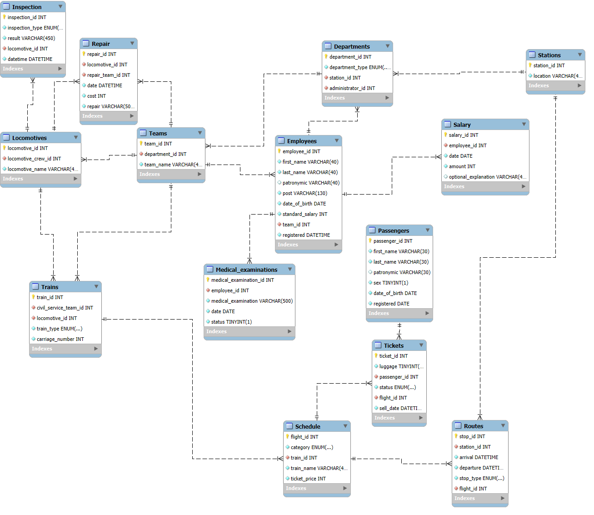

# Курсовая работа. Информационная система железнодорожной станции

## О проекте

Курсовая работа объединяет реляционную базу MySQL и настольный клиент на PyQt5. Система хранит сведения о персонале, подразделениях, локомотивах, поездах, расписании, пассажирах и билетах, а также предоставляет отчёты и вызов хранимых процедур.

## ER-диаграмма



## Возможности

- авторизация пользователей MySQL с учётом выданных прав;
- просмотр таблиц и выполнение прикладных процедур;
- статистика по сотрудникам, локомотивам, маршрутам, билетам и пассажирам;
- контроль ремонтных бригад, медосмотров и времени продажи билетов;
- построение графиков в интерфейсе PyQt5.

## Структура

```text
Kursovaya/
├── main.py
├── requirements.txt
├── ER-диаграмма.png
├── Чисто задание.docx
└── SQL/
    ├── Create Database/
    ├── Fill Database/
    ├── Procedures/
    ├── ProcedureCALLs/
    ├── Triggers/
    └── Users/
```

Каталог `Procedures` содержит 10 процедур, `Triggers` — 4 триггера, а `Users` — создание учётных записей и выдачу прав.

## Развёртывание базы

На MySQL 8.0 или новее выполните скрипты в следующем порядке:

1. `SQL/Create Database/Create_Database_Script.sql`;
2. `SQL/Fill Database/Fill_The_Table.sql`;
3. все файлы из `SQL/Procedures/` по номеру;
4. все файлы из `SQL/Triggers/` по номеру;
5. `SQL/Users/Create_Users.sql`;
6. `SQL/Users/Grant_Users_Privileges.sql`.

Для проверки процедур можно выполнить `SQL/ProcedureCALLs/CallAll.sql`.

## Настройка клиента

Создайте `.env` рядом с `main.py`:

```dotenv
HOST=localhost
PORT=3306
DB=train_station
```

Имя пользователя и пароль вводятся в окне авторизации. Установите зависимости и запустите приложение:

```powershell
python -m venv .venv
.\.venv\Scripts\Activate.ps1
pip install -r requirements.txt
python main.py
```

## Основные файлы

| Файл | Назначение |
| --- | --- |
| [`main.py`](main.py) | Графический клиент PyQt5 |
| [`requirements.txt`](requirements.txt) | Зависимости Python |
| [`Чисто задание.docx`](<Чисто задание.docx>) | Исходное задание |
| `SQL/` | Схема, данные, процедуры, триггеры и права |

## Автор

Д. М. Никитин, ГУАП, 2025. GitHub: [Diminasss](https://github.com/diminasss).
