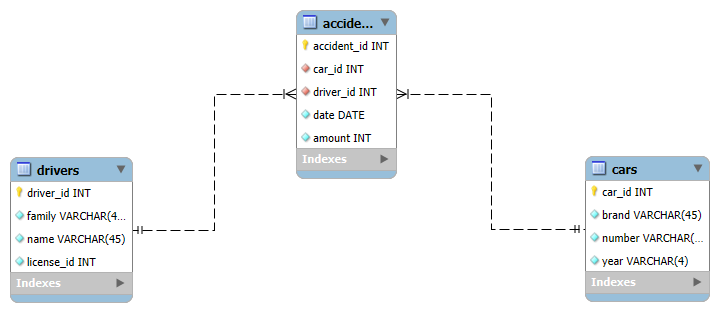

# Лабораторная работа №2. База данных «Транспортные происшествия»

## Цель работы

Спроектировать простую реляционную базу данных в MySQL Workbench и получить SQL-скрипт её создания.

## Модель данных

Схема `transportation` содержит три таблицы:

- `drivers` — водители и номера водительских удостоверений;
- `cars` — автомобили, регистрационные номера и годы выпуска;
- `accident` — происшествия с датой и суммой ущерба.

Таблица `accident` связана с `drivers` и `cars` внешними ключами. Для связей настроены каскадные обновление и удаление.

## Схема

## Файлы

| Файл | Назначение |
| --- | --- |
| [`Лаб2.sql`](Лаб2.sql) | Создание схемы `transportation` и трёх таблиц |
| [`Лаб2.mwb`](Лаб2.mwb) | Модель MySQL Workbench |
| [`Лаб2.svg`](Лаб2.svg) | Векторная версия схемы |
| [`Лаб2_отчёт.pdf`](Лаб2_отчёт.pdf) | Отчёт по работе |

## Запуск

1. Откройте `Лаб2.sql` в MySQL Workbench.
2. Подключитесь к серверу MySQL 8.0 или новее.
3. Выполните скрипт целиком.
4. Убедитесь, что появилась схема `transportation` с таблицами `drivers`, `cars` и `accident`.

## Результат

Создана связанная реляционная модель для учёта водителей, автомобилей и ДТП с контролем ссылочной целостности.
