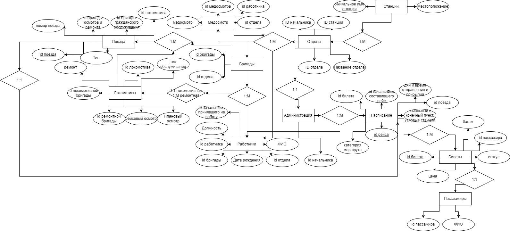

# Лабораторная работа №3. Проектирование базы данных железнодорожной станции

## Цель работы

Разработать логическую и даталогическую модели информационной системы пассажирской железнодорожной станции и сформировать DDL-скрипт для MySQL.

## Предметная область

База `TrainStation` описывает работу станции: подразделения и бригады, сотрудников и медосмотры, локомотивы и поезда, расписание, пассажиров и билеты.

Основные таблицы: `Stations`, `Departments`, `Teams`, `Employees`, `Adimnistration`, `Medical_examinations`, `Locomotives`, `Trains`, `Schedule`, `Passengers` и `Tickets`.

## Диаграммы

## Файлы

| Файл | Назначение |
| --- | --- |
| [`SCRIPT.sql`](SCRIPT.sql) | Создание схемы `TrainStation`, таблиц и внешних ключей |
| [`Лаб3.mwb`](Лаб3.mwb) | Модель MySQL Workbench |
| [`Лаб3.drawio`](Лаб3.drawio) | Исходник диаграммы draw.io |
| [`Лаб3.svg`](Лаб3.svg) | Векторная версия схемы |
| [`Лаб3_отчёт.pdf`](Лаб3_отчёт.pdf) | Отчёт по работе |

## Запуск

Откройте `SCRIPT.sql` в MySQL Workbench и выполните его на MySQL 8.0 или новее. После выполнения проверьте наличие схемы `TrainStation` и связей между созданными таблицами.

## Результат

Подготовлена полноценная модель данных станции, которая используется и развивается в следующих лабораторных работах.
