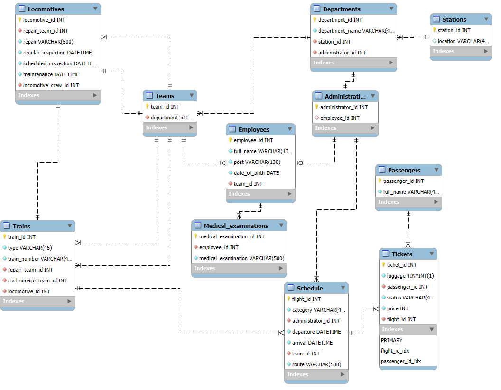

# Лабораторная работа №5. Хранимые процедуры MySQL

## Цель работы

Освоить создание и вызов хранимых процедур на примере базы железнодорожной станции.

## Реализованные процедуры

| Процедура | Назначение |
| --- | --- |
| `CheckEmployeeMedicalExamination` | Формирует список сотрудников, которым требуется медосмотр |
| `FillTestDataInTheTable` | Заполняет таблицы тестовыми данными |
| `GetRepairResult` | Находит локомотивы, которым требуется обслуживание |
| `SelectAllTablesWithSleep` | Последовательно выводит таблицы с заданной задержкой |

## Пример результата



## Файлы

- [`CheckEmployeeMedicalExamination Procedure.sql`](<CheckEmployeeMedicalExamination Procedure.sql>)
- [`FillTestDataInTheTable Procedure.sql`](<FillTestDataInTheTable Procedure.sql>)
- [`GetRepairResult Procedure.sql`](<GetRepairResult Procedure.sql>)
- [`SelectAllTablesWithSleep Procedure.sql`](<SelectAllTablesWithSleep Procedure.sql>)
- [`start_all_procedures.sql`](start_all_procedures.sql) — примеры вызовов;
- [`Лаб5_отчёт.pdf`](Лаб5_отчёт.pdf) — отчёт.

## Запуск

Сначала разверните и заполните базу `Train_Station` из `Lab4`. Затем выполните четыре файла создания процедур. Для проверки используйте вызовы из `start_all_procedures.sql`, снимая комментарий с нужной команды, например:

```sql
CALL CheckEmployeeMedicalExamination();
CALL FillTestDataInTheTable();
CALL GetRepairResult();
CALL SelectAllTablesWithSleep(2);
```

## Результат

Рутинные проверки, заполнение данных и аналитические выборки перенесены на уровень СУБД и доступны через повторно используемые процедуры.
