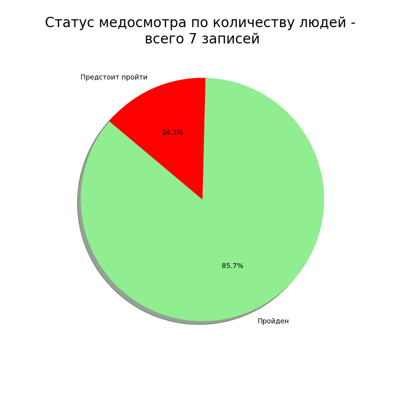
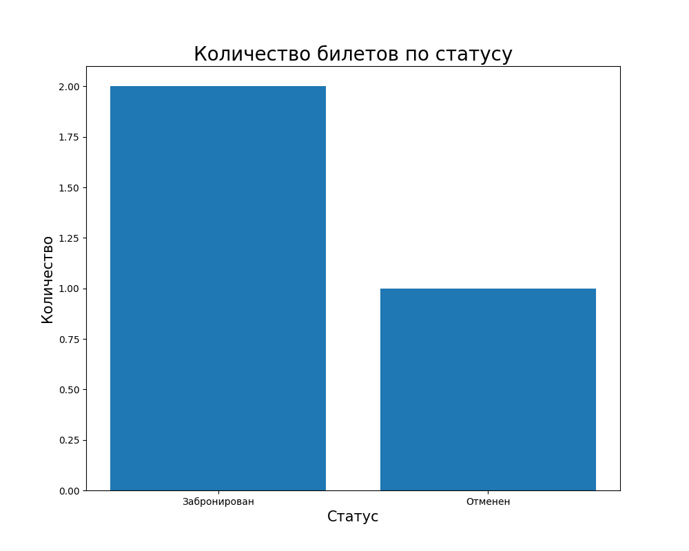
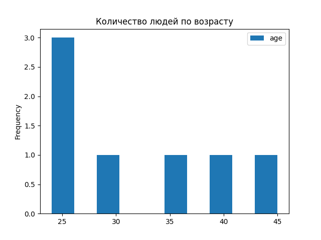

# Часть 2. Лабораторная работа №1. MySQL и визуализация данных в Python

## Цель работы

Подключить Python к MySQL, выполнить выборки из базы железнодорожной станции и представить результаты в виде диаграмм.

## Что делает программа

Скрипт `main.py`:

- выводит таблицу `administration` через `pandas`;
- строит круговую диаграмму статусов медосмотров;
- группирует билеты по статусу и строит столбчатую диаграмму;
- сортирует сотрудников по дате рождения и визуализирует возраст.

## Результаты

| Медицинские осмотры | Статусы билетов |
| --- | --- |
|  |  |



## Файлы

| Файл | Назначение |
| --- | --- |
| [`main.py`](main.py) | SQL-запросы, обработка данных и построение графиков |
| [`requirements.txt`](requirements.txt) | Зависимости Python |
| [`Ч2Лаб1_отчёт.pdf`](Ч2Лаб1_отчёт.pdf) | Отчёт по работе |
| `Графики/` | Сохранённые изображения |

## Запуск

Требуются Python 3.12+, MySQL и подготовленная база `train_station`.

```powershell
python -m venv .venv
.\.venv\Scripts\Activate.ps1
pip install -r requirements.txt
python main.py
```

Перед запуском укажите в `main.py` актуальные параметры `host`, `user`, `password` и `db`. Каталог `Графики` должен существовать. Программа сохраняет в него три PNG-файла.

## Результат

Получен пример полного цикла: SQL-запрос к MySQL, загрузка результата в `pandas` и визуализация с помощью Matplotlib.
