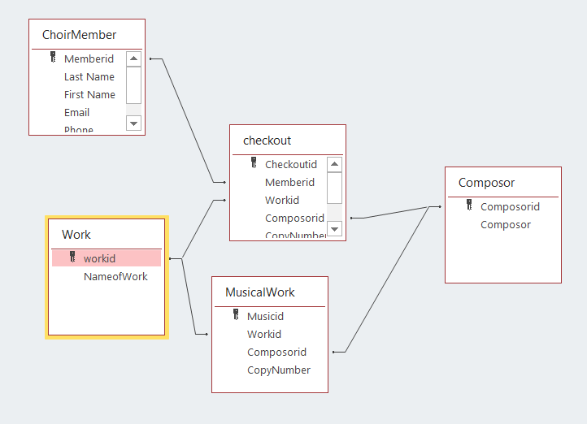
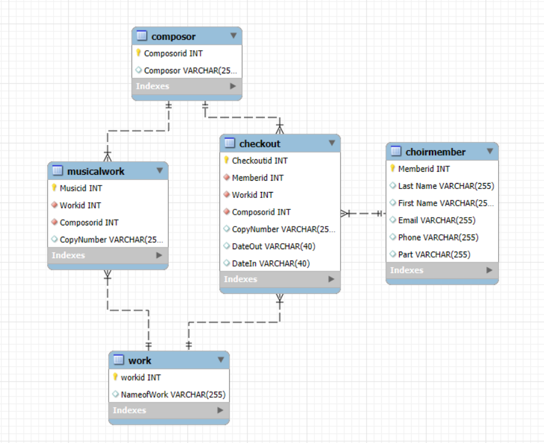

# Часть 2. Лабораторная работа №2. Миграция Microsoft Access → MySQL

## Цель работы

Перенести базу хоровой музыки из Microsoft Access в MySQL, восстановить ключи и проверить целостность схемы после миграции.

## Исходная и итоговая схемы

| Microsoft Access | MySQL |
| --- | --- |
|  |  |

## Выполненные этапы

1. Таблицы и поля приведены к согласованным английским именам.
2. Данные перенесены через MySQL ODBC Unicode Driver.
3. В MySQL создана схема `choirmusic`.
4. Скриптом `Keys.sql` восстановлены первичные и внешние ключи.
5. Для внешних ключей настроены `ON DELETE CASCADE` и `ON UPDATE CASCADE`.

В работе используются таблицы `choirmember`, `composor`, `work`, `musicalwork` и `checkout`.

## Файлы

| Файл | Назначение |
| --- | --- |
| [`ChoirMusic.accdb`](ChoirMusic.accdb) | Исходная база Microsoft Access |
| [`MigratedDataModel.mwb`](MigratedDataModel.mwb) | Модель после миграции |
| [`Keys.sql`](Keys.sql) | Восстановление первичных и внешних ключей |
| [`Ч2Лаб2_Отчёт.pdf`](Ч2Лаб2_Отчёт.pdf) | Отчёт по работе |

## Воспроизведение

1. Установите Microsoft Access, MySQL Server, MySQL Workbench и MySQL ODBC Unicode Driver.
2. Перенесите таблицы из `ChoirMusic.accdb` в схему `choirmusic`.
3. Выполните `Keys.sql` в MySQL Workbench.
4. Откройте `MigratedDataModel.mwb` и сопоставьте связи с итоговой схемой выше.

## Результат

Данные и отношения исходной Access-базы перенесены в серверную СУБД MySQL, а ссылочная целостность восстановлена SQL-скриптом.
