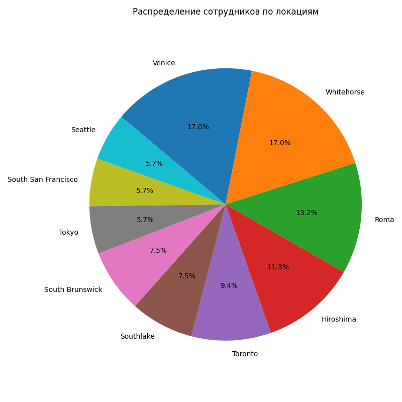

# 📊 Лабораторная работа №7  
## Визуализация данных из СУБД PostgreSQL в Python

### 🎯 Цель работы  
Реализовать интеграцию между PostgreSQL и Python для анализа данных. Построить интерактивные графики с использованием Matplotlib, отражающие ключевые метрики базы данных: распределение зарплат, структуру отделов и локаций.

---

### 🗂 Структура проекта

P2Lab7/
│
├── .venv/ # Виртуальное окружение Python
├── .idea/ # Конфигурационные файлы IDE
├── graphics/ # Сохраненные графики в формате PNG
│
├── .env # Переменные окружения (настройки подключения к БД)
├── .gitignore # Игнорируемые файлы для Git
│
├── P2Lab7.py # Основной скрипт для визуализации
├── requirements.txt # Зависимости Python
├── Ч2Лаб7_отчёт.pdf # Оформленный отчёт
└── README.md # Документация проекта (этот файл)


---

### ⚙️ Этапы выполнения

1. **Подключение к PostgreSQL**:
   - Использование библиотек `SQLAlchemy`, `psycopg2`, `matplotlib`.
   - Загрузка параметров подключения из файла `.env`.

2. **Выполнение аналитических запросов**:
   - Расчет средней и максимальной зарплаты по отделам и должностям.
   - Фильтрация данных по диапазонам (например, зарплаты от 10 000 до 25 000).

3. **Построение графиков**:
   - **Столбчатые диаграммы**:
     - Средняя зарплата по отделам (вертикальная и горизонтальная).
     - Максимальная зарплата по должностям.
   - **Круговая диаграмма**:
     - Распределение сотрудников по локациям.

4. **Модификация графиков**:
   - Добавление фильтров по диапазонам зарплат.
   - Изменение ориентации (горизонтальная ↔ вертикальная).
   - Настройка цветов и подписей.

5. **Сохранение результатов**:
   - Графики сохранены в папку `graphics/`.
   - Автоматическая генерация имен файлов с учетом параметров (например: `avg_salary_horizontal_10000_20000.png`).

---

### 🧠 Используемые инструменты

- **PostgreSQL 13+** (СУБД)
- **Python 3.10+** (язык программирования)
- **SQLAlchemy** (ORM для работы с БД)
- **Matplotlib** (визуализация данных)
- **pandas** (анализ и обработка данных)
- **dotenv** (загрузка переменных окружения)

---

### 📌 Навыки, продемонстрированные в работе

- Интеграция Python и PostgreSQL через ORM.
- Выполнение сложных SQL-запросов с агрегатными функциями (`AVG`, `MAX`, `COUNT`).
- Построение интерактивных графиков с фильтрацией данных.
- Работа с транзакциями и сессиями в SQLAlchemy.
- Настройка визуальных параметров графиков (цвета, подписи, легенды).

---

### 📈 Примеры графиков

| **Средняя зарплата по отделам**       | **Максимальные зарплаты по должностям** |
|---------------------------------------|------------------------------------------|
|  |  |

| **Распределение сотрудников по локациям** |
|-------------------------------------------|
|  |

---

### 👤 Об авторе

**ФИО:** Д.М. Никитин  
**Группа:** 4217  
**GitHub:** [https://github.com/Diminasss](https://github.com/Diminasss)

---

> 📎 Для запуска проекта:
> 1. Установите зависимости:  
>    ```bash
>    pip install -r requirements.txt
>    ```
> 2. Настройте параметры подключения к PostgreSQL в файле `.env`.  
> 3. Запустите скрипт:  
>    ```bash
>    python P2Lab7.py
>    ```