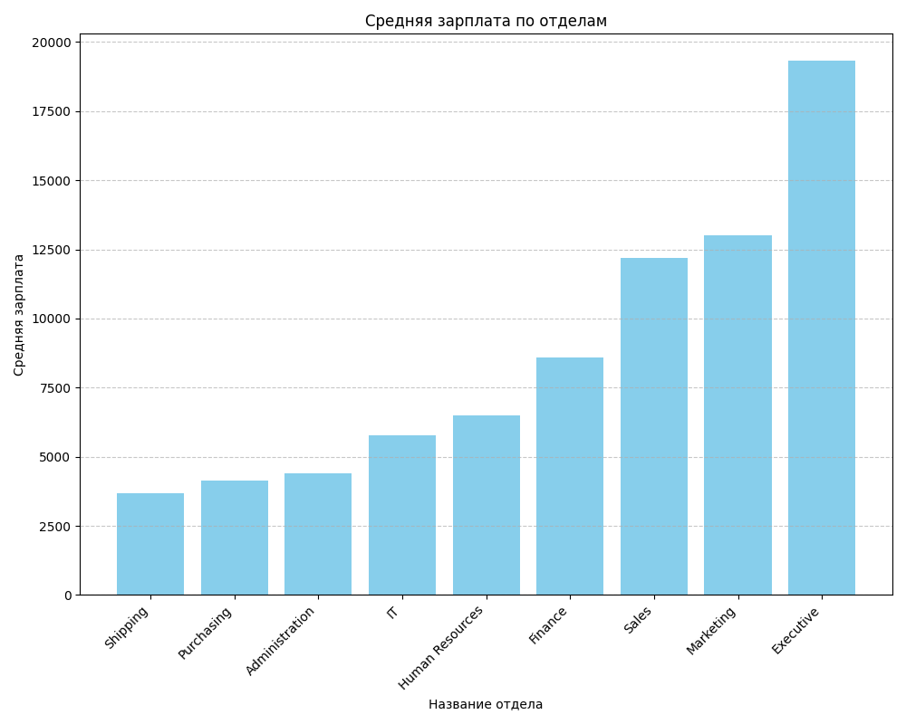
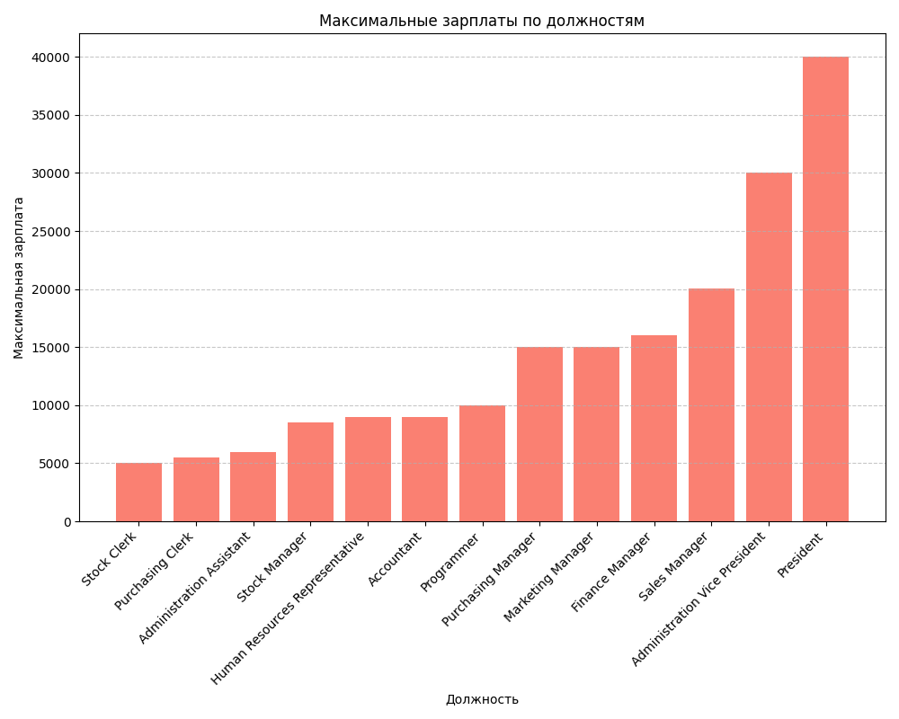
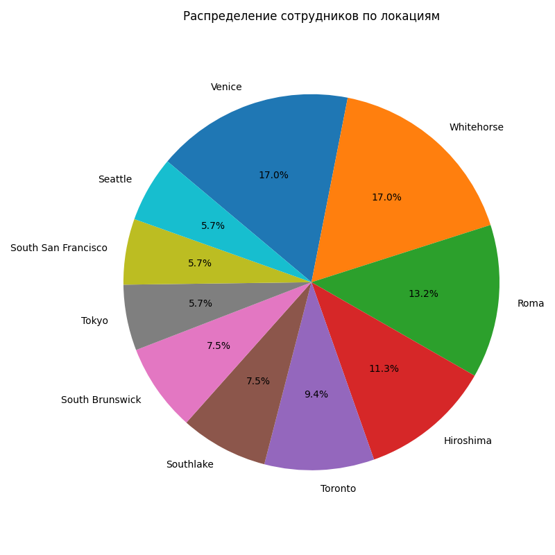

# Часть 2. Лабораторная работа №7. Визуализация данных PostgreSQL

## Цель работы

Получить аналитические данные из PostgreSQL через SQLAlchemy и построить на их основе диаграммы в Python.

## Визуализации

| Средняя зарплата по отделам | Максимальная зарплата по должностям |
| --- | --- |
|  |  |



Скрипт строит вертикальные и горизонтальные варианты зарплатных диаграмм, поддерживает фильтрацию диапазона и сохраняет девять PNG-файлов в `graphics/`.

## Файлы

| Файл | Назначение |
| --- | --- |
| [`P2Lab7.py`](P2Lab7.py) | Запросы к PostgreSQL и построение диаграмм |
| [`requirements.txt`](requirements.txt) | SQLAlchemy, pandas, Matplotlib и драйвер PostgreSQL |
| [`Ч2Лаб7_отчёт.pdf`](Ч2Лаб7_отчёт.pdf) | Отчёт по работе |
| `graphics/` | Готовые графики |

## Настройка и запуск

Работа требует Python 3.12+ и продолжает `P2Lab6`: в схеме `hr` должны существовать `employees`, `departments`, `jobs`, `locations` и заполненное поле `employees.location_id`.

Создайте `.env` с переменными `DBTYPE`, `PSQLDRIVER`, `DBUSERNAME`, `PASSWORD`, `HOST`, `PORT` и `DATABASE`, затем выполните:

```powershell
python -m venv .venv
.\.venv\Scripts\Activate.ps1
pip install -r requirements.txt
python P2Lab7.py
```

## Результат

Реализована воспроизводимая визуализация агрегированных данных PostgreSQL с помощью pandas и Matplotlib.
